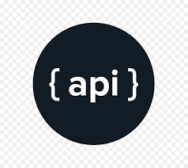

[![MIT License][license-shield]][license-url]
[![LinkedIn][linkedin-shield]][linkedin-url]

<!-- PROJECT LOGO -->
 

  

  

    A Demo REST-API project built using Java for solving a real-world problem of implementing a basic Api system in Java.
     
    <a href="https://github.com/aditya-shri/Java-API-Demo"><strong>Explore the docs »</strong></a>
     
     
    <a href="https://github.com/aditya-shri/Java-API-Demo/issues">Report Bug</a>
    ·
    <a href="https://github.com/aditya-shri/Java-API-Demo/issues">Request Feature</a>
  

<!-- TABLE OF CONTENTS -->

  
Table of Contents

  <ol>
    <li><a href="#about-the-project">About The Project</a></li>
    <li><a href="#built-with">Built With</a></li>
    <li><a href="#license">License</a></li>
    <li><a href="#contact">Contact</a></li>
  </ol>

<!-- ABOUT THE PROJECT -->
## About The Project

A Demo REST-API project built using Java for solving a real-world problem of implementing a Java based Api system.

### Built With
<!--This section should list any major frameworks that you built your project using. Leave any add-ons/plugins for the acknowledgements section. Here are a few examples.-->
* [Java](https://www.java.com/en/)
* [JSP](https://en.wikipedia.org/wiki/Jakarta_Server_Pages)
* [Servlet](https://docs.oracle.com/javaee/6/api/javax/servlet/Servlet.html)
* [GSON](https://github.com/google/gson)

<!-- LICENSE -->
## License

Distributed under the MIT License. See [License][license-url] for more information.

<!-- CONTACT -->
## Contact

Aditya Shrivastava - [@aditya-shri](https://www.linkedin.com/in/aditya-shri/) - mymail@adityashrivastava.tk

Project Link: [Java API Demo](https://github.com/aditya-shri/Java-API-Demo)

<!-- MARKDOWN LINKS & IMAGES -->
<!-- https://www.markdownguide.org/basic-syntax/#reference-style-links -->
[license-shield]: https://img.shields.io/github/license/othneildrew/Best-README-Template.svg?style=for-the-badge
[license-url]: https://github.com/aditya-shri/Java-API-Demo/blob/main/LICENSE.txt
[linkedin-shield]: https://img.shields.io/badge/-LinkedIn-black.svg?style=for-the-badge&logo=linkedin&colorB=555
[linkedin-url]: https://linkedin.com/in/aditya-shri
